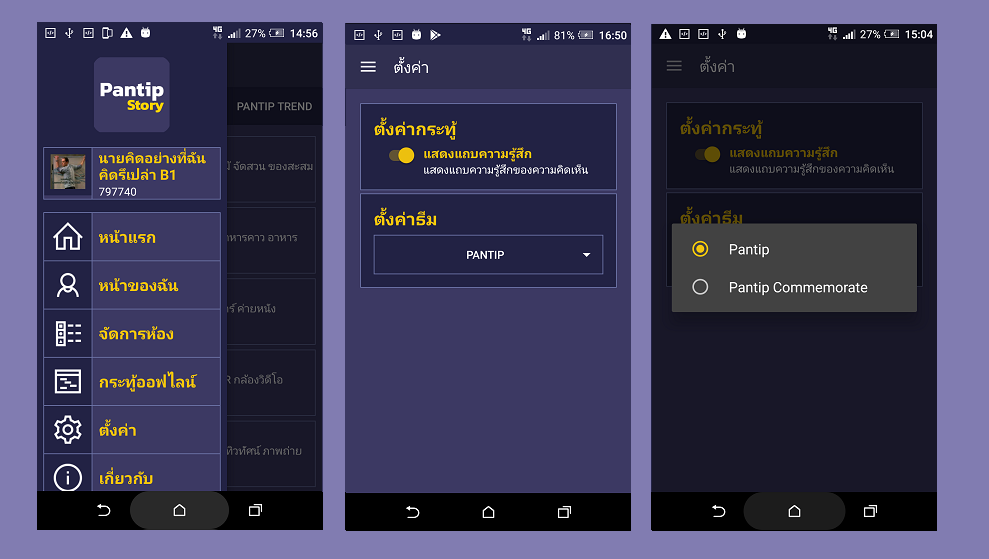
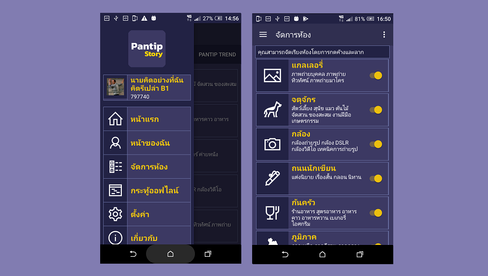

# Pantip Story 
Unofficial App for Pantip.com on Android Native.

## How to use
Open project in Android Studio.

## Blog
[Opensource App](https://benzneststudios.com/blog/benznest-app/open-source-pantip-story/) 

[App Diary](https://benzneststudios.com/blog/benznest-app/review-pantip-story-1-0/)

## Licence
Copyright 2019 benznest

Licensed under the Apache License, Version 2.0 (the "License"); you may not use this work except in compliance with the License. You may obtain a copy of the License in the LICENSE file, or at:

http://www.apache.org/licenses/LICENSE-2.0

Unless required by applicable law or agreed to in writing, software distributed under the License is distributed on an "AS IS" BASIS, WITHOUT WARRANTIES OR CONDITIONS OF ANY KIND, either express or implied. See the License for the specific language governing permissions and limitations under the License.